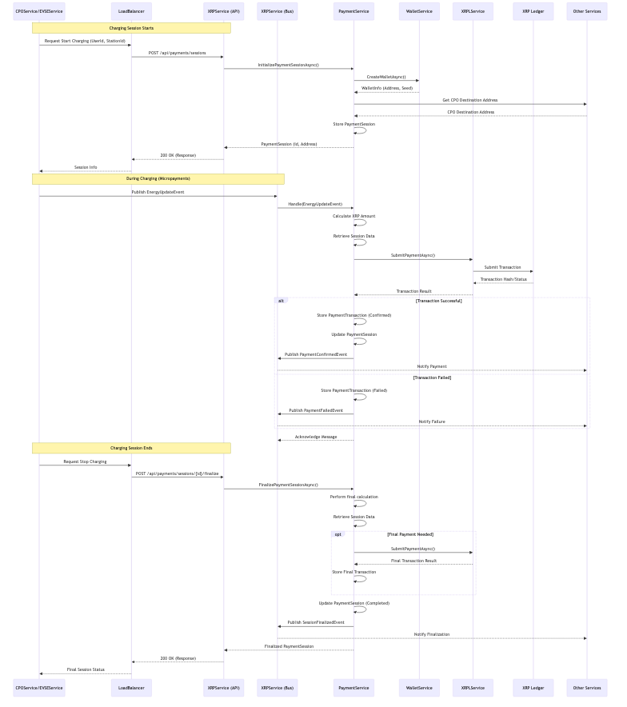

# XRPService

## Overview

XRPService is a microservice that enables XRP Ledger (XRPL) integration for EV charging payments. It provides functionality for:

- Processing real-time micropayments for EV charging sessions
- Managing XRP wallets for payment processing
- Interacting with the XRP Ledger
- Tracking payment transactions on the blockchain

## Features

- **Payment Processing**: Process micropayments in XRP for ongoing charging sessions
- **Wallet Management**: Create and manage XRP wallets for users and stations
- **Blockchain Integration**: Connect with the XRP Ledger for transaction processing
- **Transaction History**: Track and retrieve payment history for users
- **Distributed Tracing**: OpenTelemetry integration for monitoring payment flows
- **Event-Based Messaging**: MassTransit integration for asynchronous processing
- **Dockerization**: Containerized deployment with Ubuntu-based image

## Architecture

The service follows the same architectural patterns as other microservices in the system:

- **OpenTelemetry**: End-to-end tracing and metrics
- **MassTransit**: Event-based messaging
- **Minimal API**: Modern ASP.NET Core endpoints
- **Clean Architecture**: Separation of concerns into services, features, and models

## Workflow Diagram

This diagram illustrates the typical payment session lifecycle involving XRPService and other components:



<!-- Mermaid diagram removed; see xrp-workflow-diagram.png -->

## Getting Started

### Prerequisites

- .NET 9.0 SDK
- Azure Service Bus (or local equivalent)
- XRP Ledger node access (testnet/devnet for development)

### Configuration

The main configuration is in `appsettings.json`:

```json
{
  "XRPLedger": {
    "DefaultNetwork": "testnet",
    "Endpoints": {
      "Mainnet": "https://xrplcluster.com",
      "Testnet": "https://s.altnet.rippletest.net:51234",
      "Devnet": "https://s.devnet.rippletest.net:51234"
    }
  }
}
```

### Running the Service

```bash
dotnet run --project XRPService
```

### API Endpoints

#### Payment Endpoints
- **POST /api/payments/sessions**: Initialize a payment session
- **POST /api/payments/micropayments**: Process a micropayment
- **POST /api/payments/sessions/{id}/finalize**: Finalize a payment session
- **GET /api/payments/history/{userId}**: Get payment history for a user
- **GET /api/payments/wallets/{address}**: Get wallet information

#### Wallet Endpoints
- **POST /api/wallets**: Create a new XRP wallet
- **GET /api/wallets/{address}**: Get wallet information
- **POST /api/wallets/{address}/fund**: Fund a test wallet (testnet/devnet only)

## Integration

This service integrates with:

1. **EVSEService**: For charging session management
2. **XRP Ledger**: For blockchain transactions
3. **Monitoring**: OpenTelemetry for tracing payments

## Development

### Key Components

- **Services**:
  - **IXRPLService**: Interface for XRP Ledger interactions
  - **IWalletService**: Interface for wallet management
  - **IPaymentService**: Interface for payment processing
  
- **API Endpoints**:
  - **PaymentsEndpoints**: API endpoints for payment operations
  - **WalletEndpoints**: API endpoints for wallet management
  
- **Event System**:
  - **EnergyUpdateEvent**: Triggered when energy consumption is updated
  - **PaymentConfirmedEvent**: Triggered when a payment is confirmed
  - **PaymentFailedEvent**: Triggered when a payment fails
  - **SessionFinalizedEvent**: Triggered when a charging session is completed
  
- **Consumers**:
  - **EnergyUpdateConsumer**: Handles energy updates and triggers micropayments

### Testing

Test projects are organized to mirror the service structure, focusing on:

- Unit tests for service implementations
- Integration tests for API endpoints
- Mock tests for blockchain interactions

## Deployment

The service is deployed as a Docker container in Kubernetes, similar to other services in the system.

### Docker Deployment

Build and run the Docker container:

```bash
# Build the Docker image
docker build -t xrpservice:latest .

# Run the container
docker run -d -p 8080:80 --name xrpservice xrpservice:latest
```

The service uses an Ubuntu-based container with .NET 9.0 runtime.

## Learn More

- [XRP Ledger Documentation](https://xrpl.org/docs.html)
- [OpenTelemetry Documentation](https://opentelemetry.io/docs/)
